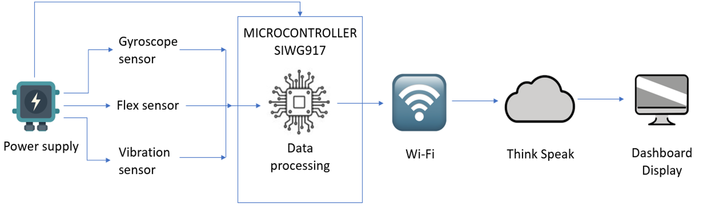
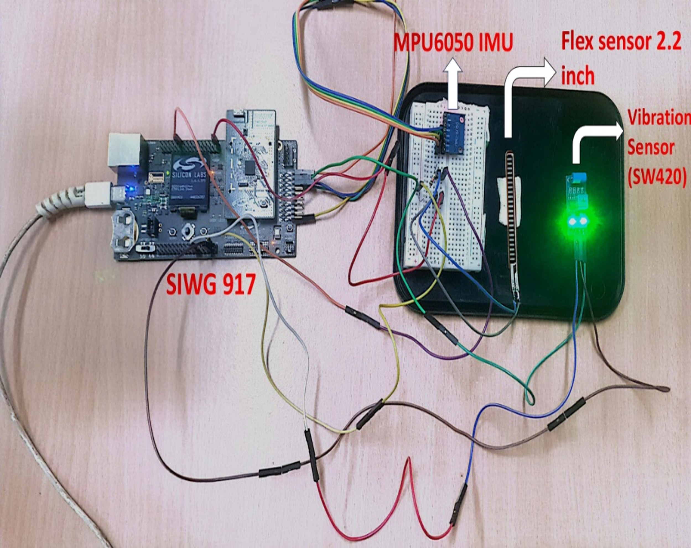
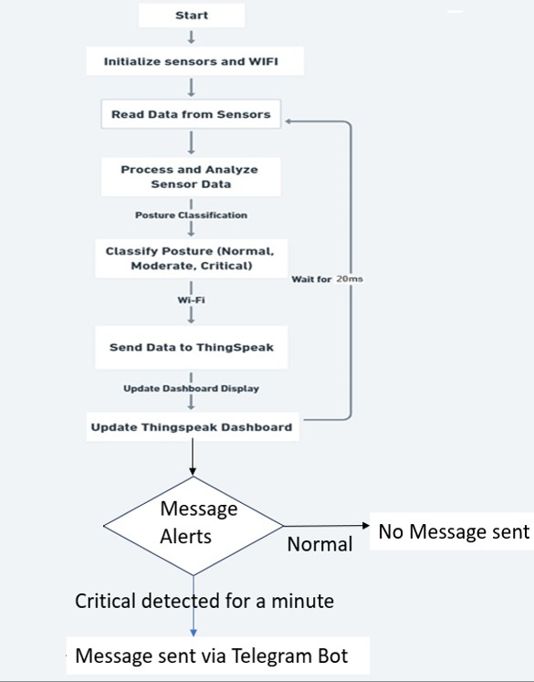
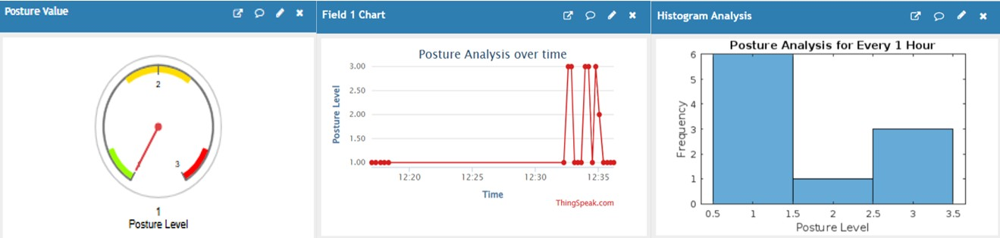
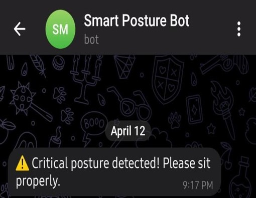

# IoT-Based Smart Posture Detection System  

## Project Overview  
The **IoT-Based Smart Posture Detection System** is designed to monitor and correct human posture in real-time using multiple sensors and IoT connectivity. Poor posture, often caused by prolonged sitting and screen exposure, can lead to chronic back pain and musculoskeletal issues.  

This project provides a **low-power, IoT-enabled solution** that tracks posture continuously, classifies it into different levels, and alerts the user instantly to encourage healthy posture habits.  

---

## Block Diagram  

  

  

---

## Features  

### Sensors Used  
- **MPU-6050 (Gyroscope & Accelerometer)** – Tracks body orientation.  
- **Flex Sensor** – Detects spinal curvature.  
- **Vibration Sensor (SW-420)** – Eliminates noisy motion detection.

### Software Requirements  
- **Simplicity Studio**  
- **VS Code** (for running Python code)  

### Processor & Connectivity  
- **SiWG917 SoC** (Wi-Fi 6 + Bluetooth LE 5.4, ARM Cortex-M4F).  
- Real-time data transmission via **Wi-Fi**.  

### Cloud & Visualization  
- ThingSpeak Dashboard with:  
  - Gauge Chart for posture levels (Normal, Moderate, Critical).  
  - Line Graph for trend monitoring.  
  - Histogram for posture frequency analysis.  

### Alerts & Notifications  
- Real-time **Telegram Bot alerts** for **Critical Posture (Level 3)**.  

---

## System Setup  

  

  

The hardware setup consists of the **SiWG917 development board** connected with MPU6050, Flex Sensor, and SW-420 vibration sensor. The system is powered via USB, and the collected data is transmitted wirelessly to the ThingSpeak cloud.  

---

## System Workflow  

  

  

1. Sensors capture posture data (spinal curvature, tilt, movement).  
2. **SiWG917** processes sensor values and classifies posture as:  
   - Normal (Level 1).  
   - Moderate (Level 2).  
   - Critical (Level 3).  
3. Data is sent to **ThingSpeak Cloud** for real-time visualization.  
4. Alerts are triggered via **Telegram Bot** when thresholds are exceeded.  

---

## Results  

  

- Accurate **real-time posture monitoring** validated with ThingSpeak visualization.  

  

- Critical posture alerts sent within **1 minute**.  
- Helps prevent musculoskeletal issues and encourages **better posture habits**.  
